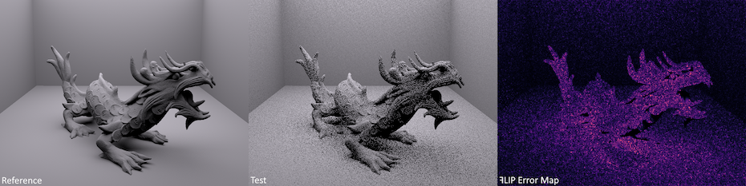

**ꟻLIP: A Difference Evaluator for Alternating Images
High Performance Graphics, 2020.**

> **NOTE** these files are the copy of those provided in https://research.nvidia.com/sites/default/files/pubs/2020-07_FLIP/flip-cpp.zip - that I'm not related in this work in any way, this repository is just a convenient copy, including a prebuilt [FLIP.exe](https://github.com/rotoglup/nvidia-flip-cpp/releases).

by Pontus Andersson, Jim Nilsson, Tomas Akenine-Moller, Magnus Oskarsson, Kalle Astrom, and Mark D. Fairchild

Pointer to the paper: https://research.nvidia.com/publication/2020-07_FLIP

code by Pontus Andersson, Jim Nilsson, and Tomas Akenine-Moller



# Original README.txt

\#\#\# C++ \#\#\#

- Code written in Visual Studio 2019.
- Allows output either in the form of a full error map (magma color map or grayscale) or histogram.
- See `flip.exe -help` for usage instructions.
- Input images are assumed to be in sRGB space and in the [0,1] range.
- Pooling code is contained in `pooling.h`.
- FLIP is contained in `FLIP.cpp`.

# Command line usage

```
FLIP v1.0
Usage: flip.exe <reference.{jpg|png}> <test.{jpg|png}> [options]

Options:
     -help                     #  Show this text
     -v <[0-2}>                #  Verbosity: 0 = silent, 1 = pooled values (default), >1 = verbose

     -heatmap <heatmap.png>    #  Generate heatmap image
     -nomagma                  #  Grayscale (FLIP values) instead of Magma heatmap (with "-heatmap")

     -histogram <filename>     #  Pooling output (<filename>.csv and <filename>.py files generated)
     -log                      #  Log10 on y-axis in the Python pooling histogram (with "-histogram").

     -ppd <pixels per degree>

        XOR

     -monitorDistance <distance to monitor in meters>
     -monitorWidth <width of monitor in meters>
     -monitorPixelsX <width of the monitor's in pixels>

  Note that you either set the ppd XOR the other monitor values (i.e., not both).
Default values:
    monitorDistance:    0.7 meters
    monitorWidth:       0.7 meters
    monitorResolutionX: 3840 pixels
    which gives 67.0206 pixels per degree (ppd)
```
